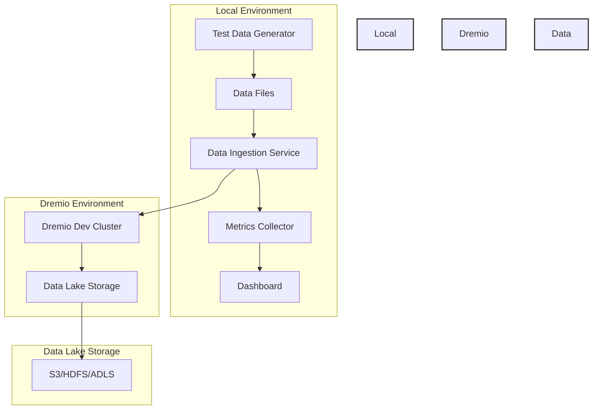
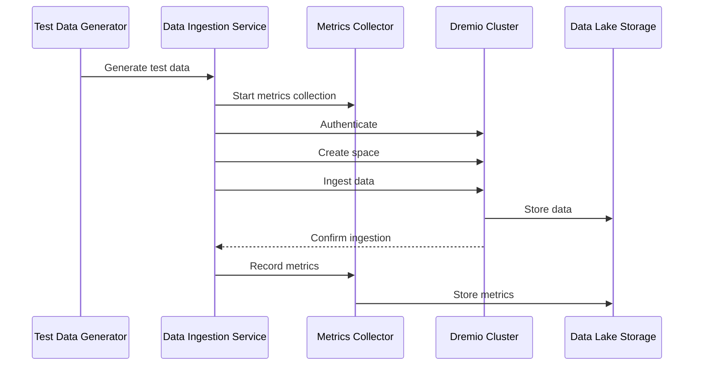

# Data Lake Performance Testing Architecture

## System Overview



## Component Details

### 1. Test Data Generator
- Generates test data in multiple formats (CSV, Parquet, ORC)
- Creates data in different sizes (1GB, 10GB, 100GB)
- Supports parallel data generation
- Validates data integrity

### 2. Data Files
- Stored locally in `test_data/` directory
- Organized by scale factor and format:
  ```
  test_data/
  ├── sf1/
  │   ├── data_1gb.csv
  │   ├── data_1gb.parquet
  │   └── data_1gb.orc
  ├── sf10/
  │   ├── data_10gb.csv
  │   ├── data_10gb.parquet
  │   └── data_10gb.orc
  └── sf100/
      ├── data_100gb.csv
      ├── data_100gb.parquet
      └── data_100gb.orc
  ```

### 3. Data Ingestion Service
- Connects to Dremio Dev Cluster
- Handles authentication and authorization
- Manages data ingestion with retry logic
- Validates files before ingestion
- Monitors ingestion progress

### 4. Metrics Collector
- Records ingestion metrics:
  - File format
  - File size
  - Ingestion time
  - Success/failure status
  - Data lake information
- Stores metrics in JSON format
- Provides aggregation and analysis

### 5. Dashboard
- Real-time visualization of metrics
- Comparison charts for:
  - File formats
  - File sizes
  - Data lakes
- Trend analysis
- Performance monitoring

### 6. Dremio Dev Cluster
- Central data processing engine
- Manages data ingestion
- Handles data transformations
- Provides query interface

### 7. Data Lake Storage
- Supports multiple storage backends:
  - Amazon S3
  - Hadoop HDFS
  - Azure Data Lake Storage
- Stores ingested data
- Manages data persistence

## Data Flow



## Configuration

### Environment Variables
```env
DREMIO_URL=http://your-dremio-host:9047
DREMIO_USERNAME=your-username
DREMIO_PASSWORD=your-password
DREMIO_SPACE=test_data
```

### Dependencies
- Python 3.8+
- Dremio API
- Data processing libraries
- Visualization tools

## Usage Flow

1. Generate test data:
```bash
python generate_test_data_formats.py
```

2. Ingest data into Dremio:
```bash
python ingest_test_data.py --sizes 1 10 100 --formats csv parquet orc
```

3. View performance dashboard:
```bash
streamlit run dashboard.py
```

## Future Enhancements

1. Additional Data Lake Support
   - HDFS integration
   - S3 integration
   - ADLS integration

2. Advanced Analytics
   - Cost analysis
   - Resource utilization
   - Network performance
   - Storage efficiency

3. Dashboard Improvements
   - Custom date ranges
   - Report exports
   - Alert system
   - Custom metrics

4. Performance Optimization
   - Parallel ingestion
   - Compression analysis
   - Memory optimization
   - Network optimization 